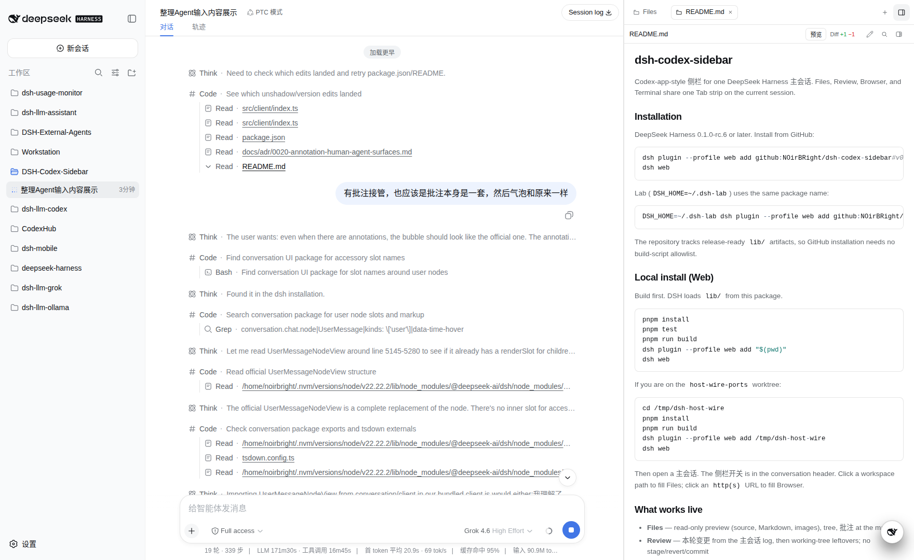
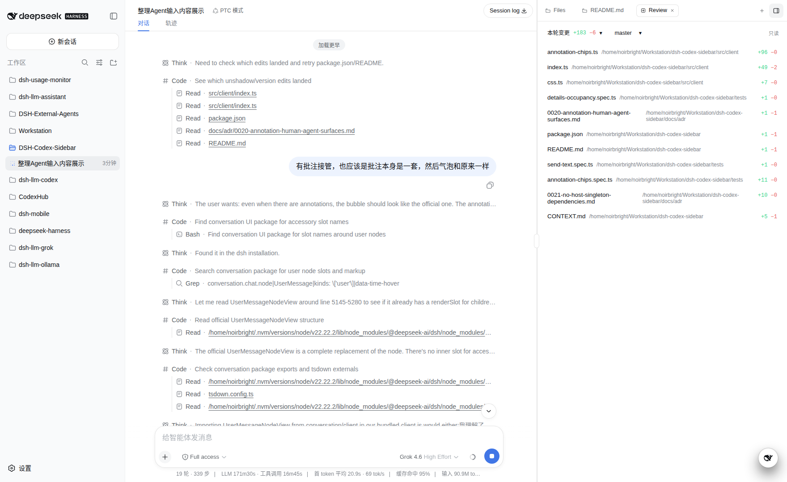
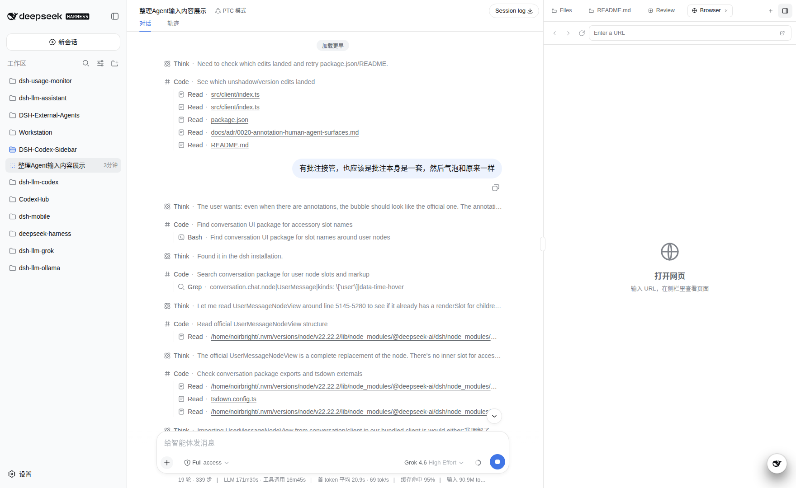
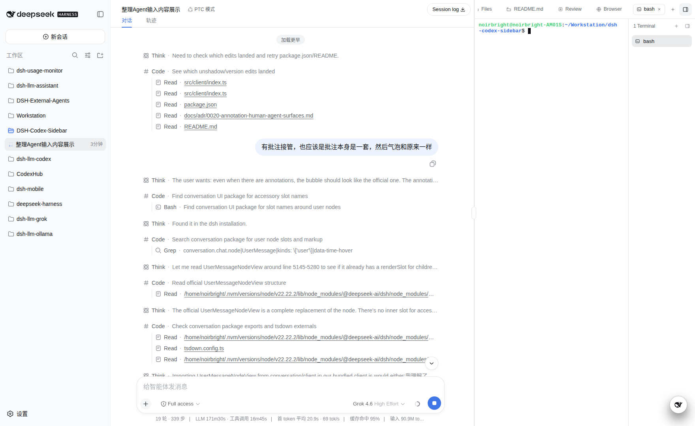
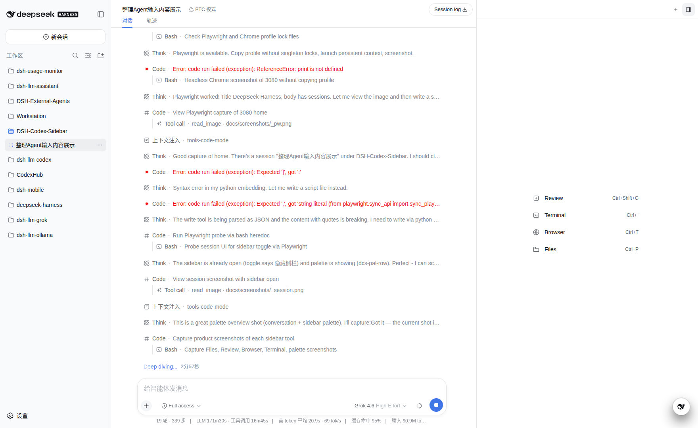

# dsh-codex-sidebar

[English](README.md) | 中文

给一条 [DeepSeek Harness](https://github.com/deepseek-ai/deepseek-harness) 主会话加上 Codex 风格右侧栏。Files、Review、Browser、Terminal 四个工具共用当前会话的一条标签栏。



## 做什么

打开主会话，点对话区标题里的侧栏开关。抽屉占用框架右侧栏，不替换聊天。

- **Files（文件）** — 只读预览（源码、Markdown、图片）和工作区树。点对话里的路径会填进来。
- **Review（审查）** — 先看本轮变更，再看工作区剩余差异。只读：不能暂存、还原或提交。
- **Browser（浏览器）** — 该标签里的托管 Chromium。主会话可用 `browser_tabs`、`browser_open`、`browser_snapshot`、`browser_click`、`browser_fill` 操作 HTTP(S) 页面和明确选择的本地 HTML 文件，侧栏开着或关着都行。Host 独占带 revision 的页面 viewport，媒体尺寸不能再改变页面大小或输入坐标。可直连时使用 Browser 自有、仅 STUN 的 WebRTC 视频；受限 Mobile 隧道继续通过已认证控制 WebSocket 使用有界 JPEG fallback。空闲页会回收；禁止在里面再打开 DSH Web 自己。
- **Terminal（终端）** — 给人用的伪终端（有 `script` 就用），不是智能体的命令行。
- **批注** — 点文件行或页面写备注。发送后官方气泡保持原样，编号标签在气泡下方。定位信息和截图作为同一条用户消息的模型证据，不塞进气泡。
- **编辑行的 +/−** — 每一行 edit/write 显示这一次的增减，跟在文件名后面。



外观跟随 DSH 主题。标签跟着这条主会话保存。侧栏不再提供 Side Chat；跨会话问答请用 DeepSeek 小管家的「引用任务」。







## 安装

需要 DeepSeek Harness 0.1.0-rc.6 或更高：

```sh
dsh plugin --profile web add github:NOirBRight/dsh-codex-sidebar#v0.3.24
dsh web
```

实验室（`DSH_HOME=~/.dsh-lab`）同样装这个包：

```sh
DSH_HOME=~/.dsh-lab dsh plugin --profile web add github:NOirBRight/dsh-codex-sidebar#v0.3.24
```

仓库里带发布用的 `lib/` 产物，从 GitHub 安装不必放行构建脚本。

0.3.0 起，Review/Files 工作区投影按需异步执行：收起侧栏不会扫描 git；Review 文件列表使用摘要，展开文件时才读取详情。侧栏状态默认按 `DSH_HOME` 隔离保存，并从旧的 `~/.dsh-codex-sidebar/sessions` 按需迁移。超大或二进制文件的详情会显示受限摘要，不会为了生成全量 LCS diff 阻塞宿主。

不要把 `@deepseek-ai/dsh-tools` 等宿主单例写进插件的 `dependencies`。提升进配置目录会盖住宿主的工具运行时，所有工具都会在 `.prepare` 上失败。

托管 Chromium 配置文件的派生缓存预算默认为 256 MiB。托管 Browser 的布局、直连媒体与 fallback 上限也都通过加载配置校验：

```yaml
- name: dsh-codex-sidebar
  config:
    managedBrowser:
      cacheBudgetBytes: 268435456
      layoutSettleMs: 180
      layoutHysteresisPx: 8
      preferredMediaRoute: webrtc-preferred
      stunUrls: []
      webrtcNegotiationTimeoutMs: 5000
      webrtcRetryCooldownMs: 30000
      maxMediaPeers: 3
      maxEncoderPages: 3
      directVideoFrameRate: 10
      directVideoMaxBitrate: 2000000
      directVideoCaptureQuality: 80
      directVideoCaptureMaxScale: 1.5
      directVideoCaptureMaxRawBytes: 491520
      desktopJpegQuality: 80
      desktopJpegFrameIntervalMs: 100
      desktopJpegMaxScale: 1.5
      desktopScreencastEveryNthFrame: 2
      desktopJpegInteractionBurstFrames: 20
      desktopJpegMaxRawBytes: 491520
      mobileJpegQuality: 65
      mobileJpegFrameIntervalMs: 250
      mobileJpegMaxScale: 1
      mobileScreencastEveryNthFrame: 4
      mobileJpegInteractionBurstFrames: 4
      mobileJpegMaxRawBytes: 98304
      mediaIdleTimeoutMs: 300000
      mediaHideGraceMs: 15000
      streamShutdownTimeoutMs: 2000
```

phone、tablet、laptop 三个固定预设仍为 `390×844`、`768×1024`、`1280×800`。fit 模式只在容器稳定后提交一次受限 viewport；选择固定预设只通过其 v2 控制连接发送一次 proposal，持久化会话和 ticket 路径不会直接提交布局。固定预设不读取容器 resize。Host 会在每次 proposal 后验证精确目标 Page 的 CSS viewport，未变化的 proposal 也不例外；如果 Playwright 已完成但尺寸未生效，Host 会通过绑定同一 identity 的 CDP metrics override 重试，仍无法验证时关闭目标而不是发布虚假布局。每条控制连接只绑定一个精确的 managed Page/CDP identity；目标被替换时连接会断开。WebRTC 只传视频，不请求摄像头、麦克风或音频。`stunUrls` 只接受 `stun:` URL，拒绝 TURN；空列表仍可使用 Host ICE candidate，需要 NAT discovery 的部署必须配置获准的 STUN 服务。诊断时可把 `preferredMediaRoute` 设为 `jpeg-only`。

无 Origin 的 Mobile 隧道会在 Browser JSON frame 外再套一层 Base64。默认 96 KiB 上限针对编码后的 JPEG 字节，完整 tunnel plaintext 仍低于 200 KiB 限制。Fallback 可以降低 JPEG quality 或编码分辨率，但绝不改变已提交的 CSS viewport。`desktopJpegFrameIntervalMs` 和 `mobileJpegFrameIntervalMs` 是捕获速率硬上限，交互触发的 frame 也不能绕过。每次交互、导航、刷新或布局提交后，最多再允许 `desktopJpegInteractionBurstFrames` 或 `mobileJpegInteractionBurstFrames` 个被动 screencast 更新；预算耗尽后，纯动画页面停止传帧。新活动会补满预算并保留最新 dirty update。WebRTC 直连视频使用独立的 `directVideoCaptureQuality`、`directVideoCaptureMaxScale` 和 `directVideoCaptureMaxRawBytes` profile，从 Host 已提交 viewport 捕获，不受控制 socket 是否带 Origin 影响；这些仅供 encoder 使用的 JPEG 字节不会进入 Mobile 隧道。每条连接最多保留一个 capture、一个未确认 frame 和一个 latest dirty request。

Browser surface 会按用户实际可呈现的 route 显示 `Direct video`、`Low-bandwidth fallback`、`Reconnecting video` 或 `Video unavailable`。Autoplay、decode、缺少 track、首帧、peer 与本地 negotiation 失败只会 decline 精确匹配当前 owner/layout/media generation 的媒体，Host 因而能恢复 JPEG，旧 generation 不会中断当前 route。

`ManagedBrowserStream.diagnostics()` 提供不随页面内容增长的计数、仪表和延迟汇总，不记录页面 URL 或内容。它包含最近 viewport revision/media generation、capture、fallback 编码/发送、编码器 Canvas paint、fallback 端到端 ACK 延迟、编码字节与 route budget drop、媒体结果，以及当前 peer、encoder Page、capture、socket 和 timer 数量。`resources()` 仍保持既有 socket、timer、capture、未确认 frame 和 peer 字段不变。媒体容量满时，先释放最老的隐藏 owner，再释放最老且仍处于 fallback 协商阶段的 owner；可见且活跃的直连 peer 不会因容量被逐出，没有安全候选时新请求以 `local-capacity` 回退。`maxMediaPeers` 不得大于 `maxEncoderPages`，无效容量配置会在插件加载时直接报错。

以上数值均为默认值。`mediaIdleTimeoutMs` 会释放无活动的直连视频 peer，但保留目标 Page；后续交互可在重试冷却期结束后重新协商。当文档或 Browser surface 变为隐藏时，`mediaHideGraceMs` 会在短暂恢复窗口内保留控制连接。切换到其他工具 Tab 时，Browser surface 在这段时间内保持挂载，但处于 hidden、inert 状态，不占布局也不接收输入。到期前恢复可取消回收；到期后会关闭控制连接并释放对应 peer 和 encoder，但不会关闭目标 Page。插件关闭时先立即撤销本地 HTML capability，再允许 stream socket、Chromium target 和已启动任务在 `streamShutdownTimeoutMs` 内安全结束；超时后停止等待无响应的清理。

Chromium 启动前，插件只会对允许列表中的派生缓存目录执行只读且不跟随符号链接的容量估算。Persistent Context 启动过程由 Chromium 自身仲裁单例；插件不会重命名、删除或修复配置文件路径。Context 成功启动后，超预算估算会触发一次临时空白 Page 和 CDP session，依次执行 `Network.enable` 与 `Network.clearBrowserCache`，并始终 detach、close。清理失败只记录警告，不会丢弃 Context。Chromium 缓存 API 不影响 Cookie、Local Storage 和 IndexedDB；磁盘与媒体缓存启动参数继续限制后续增长。

Browser 地址栏也支持绝对 `file:///.../page.html` 或 `.htm` 地址。Host 要求入口是普通文件且不是符号链接，并通过独立、仅绑定 `127.0.0.1:0` 的服务器，用随机 capability 投影该文件的 canonical parent；相对资源只能留在这个目录内，不提供目录列表，拒绝目录穿越，而且只响应 `GET`／`HEAD`。文件打开后，Host 会再次解析请求路径；如果当时观测到的设备／inode 身份与已打开 handle 不同，就拒绝请求。这些检查会拒绝静态符号链接和已观测到的路径变化，但不把同一操作系统用户下进程对已授权文件的并发修改视为安全边界。同一 Tab 的打开操作严格串行，并共用唯一 Page／CDP 身份。只有 Chromium 收到私有 HTTP 地址；会话状态、工具、诊断、桌面端和远程 Mobile 端始终只看到公开 `file:` 地址，不会收到回环端口或 capability。关闭 Tab 或会话会撤销该目录；卸载插件会先于 Chromium teardown 撤销所有 capability，并独立于卡住的 Browser 清理关闭监听；「外部打开」仍只支持 HTTP(S)。

本地 HTML 是主动内容：其中的脚本能读取所选 HTML 目录内提供的资源，也能发起网络请求。只打开可信 HTML；生成的原型应放进专用目录，不要与凭据或无关文件放在一起。

DSH session 被释放时，插件会立即关闭该 session 的 Browser 控制连接和托管 Page；仅隐藏 Browser 时则在配置的宽限期后释放媒体，并保留 Page 供 Agent 工具继续使用。

## 本地安装

```sh
pnpm install
pnpm test
pnpm run build
dsh plugin --profile web add "$(pwd)"
dsh web
```

然后打开主会话，用侧栏开关。

## 规格

见 `CONTEXT.md` 与 `docs/adr/`。
